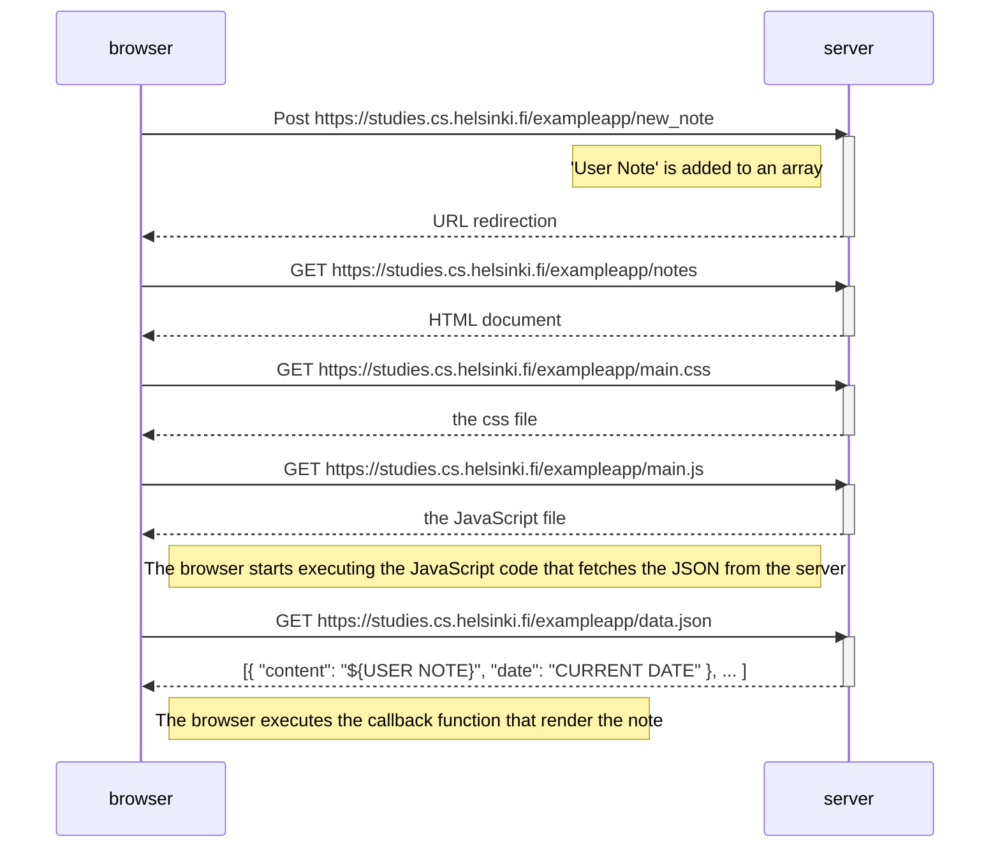

```mermaid

sequenceDiagram
    participant browser
    participant server

    browser->>server: Post https://studies.cs.helsinki.fi/exampleapp/new_note
    activate server

    Note left of server: 'User Note' is added to an array
    
    server-->>browser: URL redirection
    deactivate server


    browser->>server: GET https://studies.cs.helsinki.fi/exampleapp/notes
    activate server
    server-->>browser: HTML document
    deactivate server

    browser->>server: GET https://studies.cs.helsinki.fi/exampleapp/main.css
    activate server
    server-->>browser: the css file
    deactivate server

    browser->>server: GET https://studies.cs.helsinki.fi/exampleapp/main.js
    activate server
    server-->>browser: the JavaScript file
    deactivate server

    Note right of browser: The browser starts executing the JavaScript code that fetches the JSON from the server

    browser->>server: GET https://studies.cs.helsinki.fi/exampleapp/data.json
    activate server
    server-->>browser: [{ "content": "${USER NOTE}", "date": "CURRENT DATE" }, ... ]
    deactivate server

    Note right of browser: The browser executes the callback function that render the note

```