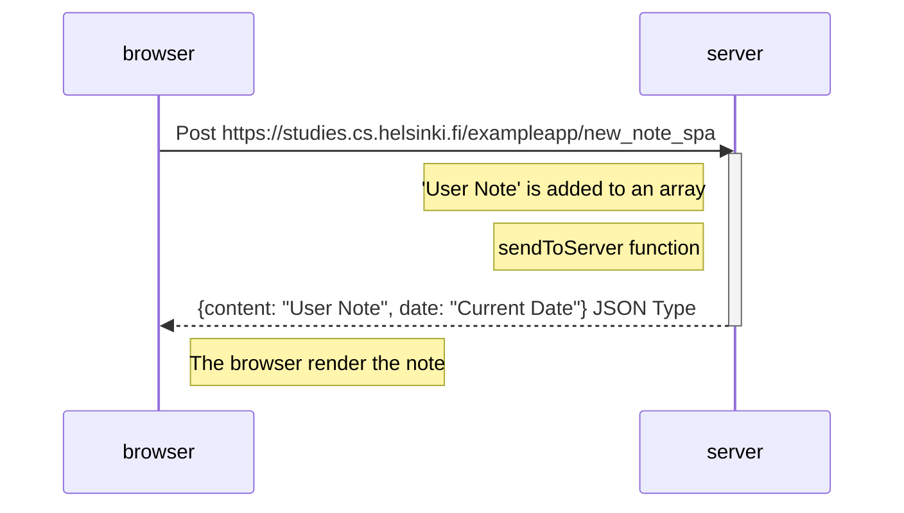

```mermaid

sequenceDiagram
    participant browser
    participant server

    browser->>server: Post https://studies.cs.helsinki.fi/exampleapp/new_note_spa
    activate server

    Note left of server: 'User Note' is added to an array
    Note left of server: sendToServer function

    server-->>browser: {content: "User Note", date: "Current Date"} JSON Type
    deactivate server

    Note right of browser: The browser render the note

```